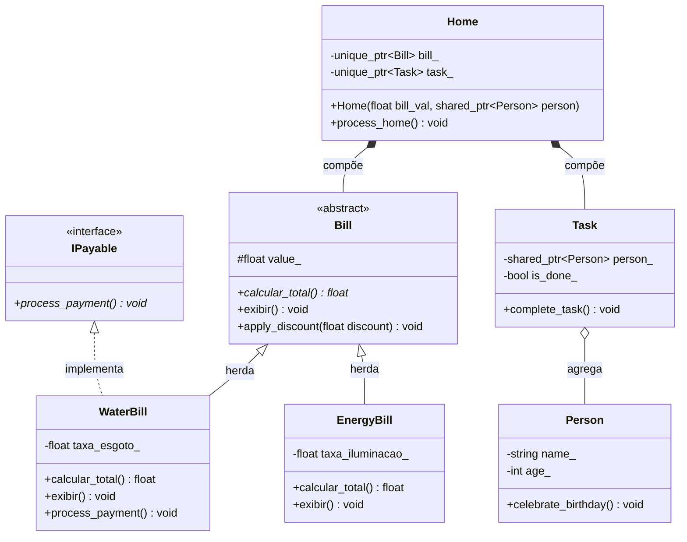

# Sistema-Orientacao-a-Objetos

**Nome:** Geraldo Nunes de Oliveira Neto,
**Matrícula:** 20250018735

# Ideia do projeto:
Sistema de organização de uma residência, gerenciando membros da família, compromissos, tarefas domésticas e despesas financeiras. O objetivo é permitir a atribuição de tarefas específicas a individuos da casa e rastrear os gastos gerais gerados, mantendp um histórico centralizado de responsabilidades e finanças.

## Diagrama UML

## Herança Avançada

A classe `EnergyBill` foi marcada como `final` (no nível de classe) porque ela representa uma entidade de negócio completa e folha na nossa árvore de domínio. Essa garantia de design assegura que ninguém no futuro crie uma subclasse de `EnergyBill` para injetar comportamentos indesejados (como substituir a lógica do `calcular_total()` sem controle) ou adicionar taxas extras que fujam da estrutura rígida dessa conta. Isso previne bugs arquiteturais onde a lógica dessa folha poderia ser acidentalmente corrompida por polimorfismo excessivo.
