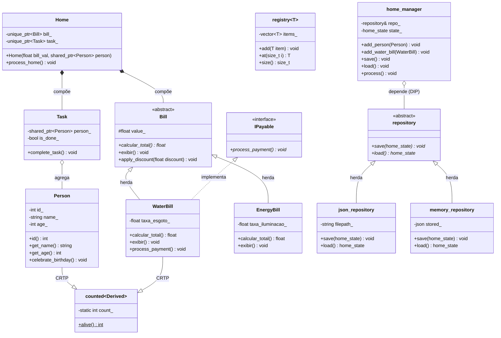
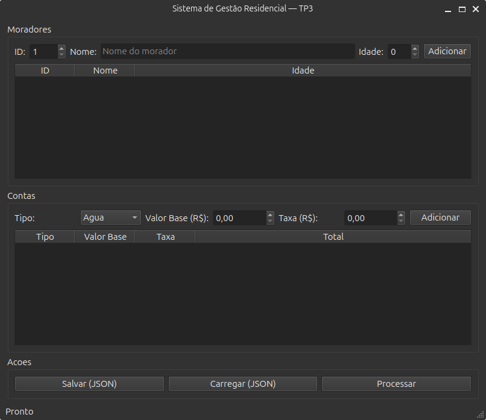

# Sistema-Orientacao-a-Objetos

**Nome:** Geraldo Nunes de Oliveira Neto,
**Matrícula:** 20250018735


# Ideia do projeto:
Sistema de organização de uma residência, gerenciando membros da família, compromissos, tarefas domésticas e despesas financeiras. O objetivo é permitir a atribuição de tarefas específicas a individuos da casa e rastrear os gastos gerais gerados, mantendp um histórico centralizado de responsabilidades e finanças.

## Diagrama UML



## Herança Avançada

A classe `EnergyBill` foi marcada como `final` (no nível de classe) porque ela representa uma entidade de negócio completa e folha na nossa árvore de domínio. Essa garantia de design assegura que ninguém no futuro crie uma subclasse de `EnergyBill` para injetar comportamentos indesejados (como substituir a lógica do `calcular_total()` sem controle) ou adicionar taxas extras que fujam da estrutura rígida dessa conta. Isso previne bugs arquiteturais onde a lógica dessa folha poderia ser acidentalmente corrompida por polimorfismo excessivo.

---

## Programação Genérica

### Template `registry<T>`

O template `registry<T>` abstrai o padrão de **registro indexado de entidades** — um problema recorrente em qualquer sistema de domínio. Em vez de criar classes separadas `RegistroDePessoas`, `RegistroDeContas`, etc., usamos um único template genérico que funciona com qualquer tipo. No projeto, ele é instanciado com `Person` e `WaterBill`, provando sua reutilização real.

### CRTP `counted<Derived>` vs herança virtual

Usamos CRTP (`counted<Derived>`) em vez de herança virtual para contagem de instâncias porque:
- **Sem custo de vtable**: a contagem é resolvida em tempo de compilação, sem overhead de chamada virtual.
- **Contadores independentes**: cada classe derivada (`Person`, `WaterBill`) tem seu próprio contador estático, sem necessidade de runtime type dispatch.
- Com herança virtual, precisaríamos de um `virtual int alive()` na base e cada classe concreta implementaria sua contagem — adicionando overhead de indireção para uma operação que é fundamentalmente estática.

### Pipeline de ranges — antes vs. depois

**Antes (laço manual):**
```cpp
for (const auto& c : contas) {
    if (c.calcular_total() > 60) {
        std::cout << c.calcular_total() << "\n";
    }
}
```

**Depois (ranges C++20):**
```cpp
auto totais_caros = contas
    | rv::filter([limite](const auto& c) { return c.calcular_total() > limite; })
    | rv::transform([](const auto& c) { return c.calcular_total(); });
for (double total : totais_caros)
    std::cout << total << "\n";
```

O pipeline de ranges é **declarativo** (o que fazer, não como), **composável** (cada adaptador é independente) e **lazy** (só processa elementos sob demanda).

---

## SOLID

### SRP — Single Responsibility Principle
Cada classe tem uma única responsabilidade:
- `Person` → dados de um morador
- `WaterBill` / `EnergyBill` → cálculo de uma conta específica
- `home_manager` → orquestração de alto nível
- `json_repository` → persistência em disco
- **Refatoração SRP aplicada**: no TP2, `Home` acumulava lógica de negócio (processar contas, gerenciar pessoas) e persistência. No TP3, separamos a orquestração em `home_manager` e a persistência em `repository`, cada um com uma única razão para mudar.

### OCP — Open/Closed Principle
- **Ponto de extensão OCP**: a hierarquia `Bill` (classe abstrata) está aberta para extensão (criar `InternetBill`, `GasBill`) mas fechada para modificação — basta herdar de `Bill` e implementar `calcular_total()`. O mesmo vale para `repository`: criar uma `database_repository` não exige alterar nenhuma classe existente.

### LSP — Liskov Substitution Principle
`WaterBill` e `EnergyBill` substituem `Bill` em qualquer contexto (vetores de `unique_ptr<Bill>`, `get_max_bill()`, `soma_total()`). `json_repository` e `memory_repository` substituem `repository` sem alterar o comportamento esperado de `home_manager`.

### ISP — Interface Segregation Principle
`IPayable` é uma interface segregada: apenas `WaterBill` a implementa (porque `EnergyBill` não possui pagamento online no domínio). Nenhuma classe é forçada a implementar métodos que não usa.

### DIP — Dependency Inversion Principle
`home_manager` depende da abstração `repository&`, não das implementações concretas `json_repository` ou `memory_repository`. A dependência é **injetada no construtor**, permitindo trocar a implementação sem alterar a lógica de negócio — inclusive usando `memory_repository` nos testes unitários sem tocar o disco.

---

## Build e Execução

### Requisitos
- Compilador com suporte a C++20 (GCC ≥ 10, Clang ≥ 10)
- CMake ≥ 3.14

### Compilação
```bash
cmake -B build -DCMAKE_BUILD_TYPE=Release
cmake --build build
```

### Execução
```bash
./build/meu_exe
```

### Testes
```bash
cd build && ctest --output-on-failure
```

### ThreadSanitizer (concorrência)
```bash
cmake -B build_tsan -DCMAKE_CXX_FLAGS="-fsanitize=thread" -DCMAKE_EXE_LINKER_FLAGS="-fsanitize=thread"
cmake --build build_tsan
./build_tsan/meu_exe
```
A concorrência usa `std::async` com tarefas independentes (cada `calcular_total()` é `const` e não modifica estado compartilhado), e a agregação dos resultados é protegida por `std::mutex` + `std::lock_guard`. O ThreadSanitizer não reporta data races.

---

## Qt (Interface Gráfica)

Foi adicionada uma interface gráfica mínima utilizando **Qt6 Widgets** para expor as operações principais do domínio, respeitando a arquitetura existente.

### Camada Fina e Integração
A janela (`main_window`) atua como uma **camada fina**, ou seja, não contém regras de negócio. Ela apenas coleta os inputs do usuário, chama os métodos de `home_manager` e exibe os resultados na tela. O carregamento e salvamento chamam diretamente a serialização JSON implementada na Questão 4, conectando botões aos métodos já validados nos testes automatizados.

### Instruções de Build
O `CMakeLists.txt` foi configurado para buscar e usar o Qt6 de forma segura:
```cmake
find_package(Qt6 QUIET COMPONENTS Widgets)
if(Qt6_FOUND)
    set(CMAKE_AUTOMOC ON)
    qt_add_executable(gui src/gui_main.cpp src/main_window.hpp)
    target_link_libraries(gui PRIVATE Qt6::Widgets nlohmann_json::nlohmann_json)
endif()
```
Certifique-se de possuir o pacote de desenvolvimento do Qt6 instalado (ex.: `sudo apt-get install qt6-base-dev`).

Para rodar a interface:
```bash
cmake -B build -DCMAKE_BUILD_TYPE=Release
cmake --build build --target gui
./build/gui
```

### Screenshot da Execução
> **Observação:** Adicione um screenshot real de `./build/gui` rodando no seu ambiente substituindo o placeholder abaixo antes de entregar o trabalho final.


